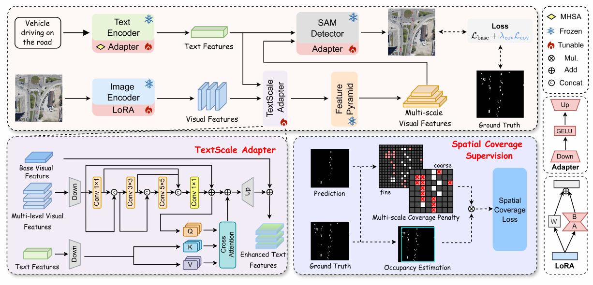

# RefSAM3-RS

RefSAM3-RS is a parameter-efficient SAM3-based framework for referring remote
sensing image segmentation. It introduces a TextScale Adapter (TSA) for
text-guided multilevel feature adaptation and Spatial Coverage Supervision
(SCS) for improving mask completeness of irregular and spatially dispersed
targets.



## Installation
```bash
git clone https://github.com/RyanXia0718/RefSAM3-RS.git
cd RefSAM3-RS

conda create -n refsam3_rs python=3.12 -y
conda activate refsam3_rs

bash run.sh install
```

## Preparation

### SAM3 checkpoint

Request access to the pretrained checkpoint from the official
[SAM3 model repository](https://huggingface.co/facebook/sam3), download
`sam3.pt`, and place it at:

```text
checkpoints/sam3_base/sam3.pt
```

### Datasets

We evaluate RefSAM3-RS on
[RefSegRS](https://huggingface.co/datasets/JessicaYuan/RefSegRS) and
[RRSIS-D](https://github.com/Lsan2401/RMSIN). We use the
[SAM3-I](https://aclanthology.org/2026.acl-long.1255/)-compatible COCO-style
annotation format, which follows the standard COCO `images`, `annotations`,
and `categories` structure and stores referring expressions in
`images[].text_inst_input.simple_query`.
Arrange the datasets as follows:

```text
RefSAM3-RS/
├── datasets/
│   ├── RefSegRS/
│   │   ├── images/
│   │   ├── sam3i_train.json
│   │   ├── sam3i_val.json
│   │   └── sam3i_test.json
│   └── RRSIS-D/
│       ├── images/rrsisd/JPEGImages/
│       ├── sam3i_train.json
│       ├── sam3i_val.json
│       └── sam3i_test.json
└── checkpoints/
    └── sam3_base/
        └── sam3.pt
```

## Training

### RefSegRS

```bash
# Stage 1
bash run.sh train --dataset refsegrs --stage 1 --gpu 0

# Stage 2
bash run.sh train --dataset refsegrs --stage 2 --gpu 0
```

### RRSIS-D

```bash
# Stage 1
bash run.sh train --dataset rrsisd --stage 1 --gpu 0

# Stage 2
bash run.sh train --dataset rrsisd --stage 2 --gpu 0
```

## Evaluation

### RefSegRS

```bash
bash run.sh eval /path/to/checkpoint.pt --dataset refsegrs
```

### RRSIS-D

```bash
bash run.sh eval /path/to/checkpoint.pt --dataset rrsisd
```

## Inference Only

```bash
bash run.sh inference \
  --annotations datasets/RefSegRS/sam3i_test.json \
  --image-root datasets/RefSegRS/images \
  --checkpoint /path/to/checkpoint.pt \
  --output outputs/refsegrs_predictions.json
```

## Repository Structure

```text
RefSAM3-RS/
├── run.sh                    # Unified installation and execution entry
├── scripts/
│   ├── train.sh              # Two-stage training launcher
│   ├── eval.sh               # Inference and evaluation launcher
│   ├── inference.py          # Full-model inference
│   └── evaluate.py           # RRSIS metrics
└── sam3/
    ├── pyproject.toml
    └── sam3/
        ├── model/            # SAM3, adapters, LoRA, and TSA
        └── train/            # Training, losses, data, and configurations
```

## Acknowledgements

This project is built upon [SAM3](https://github.com/facebookresearch/sam3)
and follows the data format and parts of the training pipeline of
[SAM3-I](https://github.com/debby-0527/SAM3-I). We thank the authors of these
works and the creators of RefSegRS and RRSIS-D for their contributions to the
research community.

## Citation

Citation information will be added after publication.
